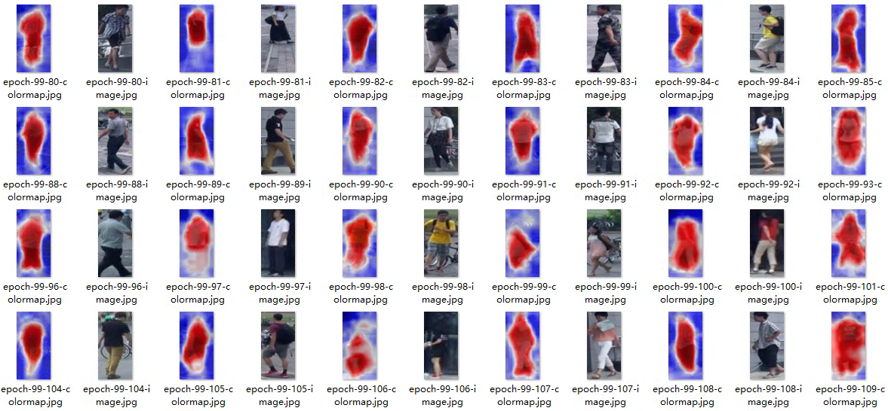

### For your custom datasets

Download the pretrained parameters (e.g., moco and detco) at [here](https://drive.google.com/drive/folders/1erzARKq9g02-3pUGhY6-hyGzD-hoty5b?usp=sharing) and put them in the current directory.

```
├── WSSS/
|   ├── core
|   ├—— ...
|   ├—— moco_r50_v2-e3b0c442.pth
|   └── detco_200ep.pth
```

1. Let's take the Market1501 dataset as an example. Make sure your ```data/Market1501``` folder is structured as follows:

```
├── bounding_box_train/ 
|   ├── xxx.jpg
|   ├── ...
├── bounding_box_test/ 
└── query/ 
```

2. Then specify the input size in ```train_CCAM.py```

```
train_transform = transforms.Compose([
        # the input size is decided by the adopted datasets
        transforms.Resize(size=(256, 128)),
        transforms.RandomHorizontalFlip(),
        # transforms.RandomCrop(size=(448, 448)),
        transforms.ToTensor(),
        transforms.Normalize(mean=(0.485, 0.456, 0.406), std=(0.229, 0.224, 0.225))
    ])
```

3. To train CCAM on the custom dataset

```
OMP_NUM_THREADS=16 CUDA_VISIBLE_DEVICES=5 python train_CCAM.py --tag CCAM_Maket1501_MOCO --batch_size 128 --pretrained mocov2 --alpha 0.25
```

The code will create experiment folders for model checkpoints (./experiment/models), log files (.experiments/logs) and visualization (./experiments/images/).

```
├── experiments/
|   ├── checkpoints
|   ├—— images
```

## Visualization



### Reference

If you are using our code, please consider citing our paper.

```
@InProceedings{Xie_2022_CVPR,
    author    = {Xie, Jinheng and Xiang, Jianfeng and Chen, Junliang and Hou, Xianxu and Zhao, Xiaodong and Shen, Linlin},
    title     = {C2AM: Contrastive Learning of Class-Agnostic Activation Map for Weakly Supervised Object Localization and Semantic Segmentation},
    booktitle = {Proceedings of the IEEE/CVF Conference on Computer Vision and Pattern Recognition (CVPR)},
    month     = {June},
    year      = {2022},
    pages     = {989-998}
}
@article{xie2022contrastive,
  title={Contrastive learning of Class-agnostic Activation Map for Weakly Supervised Object Localization and Semantic Segmentation},
  author={Xie, Jinheng and Xiang, Jianfeng and Chen, Junliang and Hou, Xianxu and Zhao, Xiaodong and Shen, Linlin},
  journal={arXiv preprint arXiv:2203.13505},
  year={2022}
}
```

