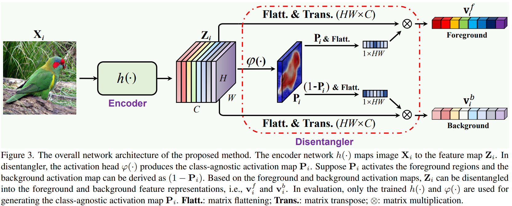
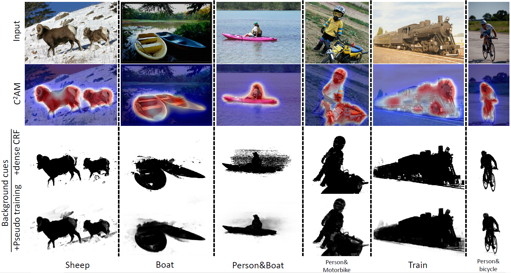
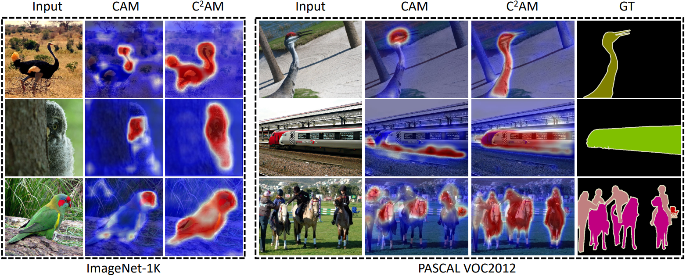

# C2AM (Unsupervised)
## Update (2022-12-12)
We update the evaluation results using ResNet50 as both localization and classfication backbone. Table is also updated in our [Arxiv paper](https://arxiv.org/abs/2203.13505).

| Method    | Loc Back. | Cls Back.  | CUB (top1/top5 loc)  | CUB (GT-Known)  | ImageNet (top1/top5 loc) | ImageNet (GT-Known) |
|:---------:|:-----------:|:----:|:----:|:----:|:----:|:----:|
| ORNet     |   VGG16         | VGG16 |   67.74 / 80.77 |  86.20 | 52.05 / 63.94 | 68.27 |
| PSOL      |  ResNet50       | ResNet50 |  70.68 / 86.64    |   90.00 | 53.98 / 63.08 | 65.44 |
| C2AM (supervised initialization)      |  ResNet50       | ResNet50 |  76.36 / 89.15   |  93.40 | 54.41 / 64.77 | 67.80 |
| C2AM (unsupervised initialization)      |  ResNet50       | ResNet50 |  74.76 / 87.37    |   91.54 | 54.65 / 65.05 | 68.07 |


Code repository for our
paper "[C2AM: Contrastive learning of Class-agnostic Activation Map for Weakly Supervised Object Localization and Semantic Segmentation](https://arxiv.org/abs/2203.13505)"
in **CVPR 2022**.

:heart_eyes: Code for our paper "[CLIMS: Cross Language Image Matching for Weakly Supervised Semantic Segmentation](https://arxiv.org/abs/2203.02668)" in **CVPR 2022** is also available at [here](https://openaccess.thecvf.com/content/CVPR2022/html/Xie_CLIMS_Cross_Language_Image_Matching_for_Weakly_Supervised_Semantic_Segmentation_CVPR_2022_paper.html).




The repository includes full training, evaluation, and visualization codes
on [CUB-200-2011](http://www.vision.caltech.edu/visipedia/CUB-200.html), [ILSVRC2012](https://image-net.org/challenges/LSVRC/2012/), and [PASCAL VOC2012](http://host.robots.ox.ac.uk/pascal/VOC/voc2012/) datasets.

**We provide the extracted class-agnostic bounding boxes (on CUB-200-2011 and ILSVRC2012) and background cues (on PASCAL VOC12) at [here](https://drive.google.com/drive/folders/1erzARKq9g02-3pUGhY6-hyGzD-hoty5b)**.




## Dependencies

* Python 3
* PyTorch 1.7.1
* OpenCV-Python
* Numpy
* Scipy
* MatplotLib
* Yaml
* Easydict

## Dataset

### CUB-200-2011

You will need to download the images (JPEG format) in CUB-200-2011 dataset
at [here](http://www.vision.caltech.edu/visipedia/CUB-200.html). Make sure your ```data/CUB_200_2011``` folder is structured as
follows:

```
├── CUB_200_2011/
|   ├── images
|   ├── images.txt
|   ├── bounding_boxes.txt
|   ...
|   └── train_test_split.txt
```

You will need to download the images (JPEG format) in ILSVRC2012 dataset at [here](https://image-net.org/challenges/LSVRC/2012/).
Make sure your ```data/ILSVRC2012``` folder is structured as follows:

### ILSVRC2012

```
├── ILSVRC2012/ 
|   ├── train
|   ├── val
|   ├── val_boxes
|   |   ├——val
|   |   |   ├—— ILSVRC2012_val_00050000.xml
|   |   |   ├—— ...
|   ├── train.txt
|   └── val.txt
```

### PASCAL VOC2012

You will need to download the images (JPEG format) in PASCAL VOC2012 dataset at [here](http://host.robots.ox.ac.uk/pascal/VOC/voc2012/).
Make sure your ```data/VOC2012``` folder is structured as follows:

```
├── VOC2012/
|   ├── Annotations
|   ├── ImageSets
|   ├── SegmentationClass
|   ├── SegmentationClassAug
|   └── SegmentationObject
```

## For WSOL task

please refer to the directory of './WSOL'

```
cd WSOL
```

## For WSSS task

please refer to the directory of './WSSS'

```
cd WSSS
```

### Comparison with CAM



## CUSTOM DATASET

As CCAM is an unsupervised method, it can be applied to various scenarios, like ReID, Saliency detection, or skin lesion detection. We provide an example to apply CCAM on your custom dataset like 'Market-1501'.

```
cd CUSTOM
```


## Reference

If you are using our code, please consider citing our paper.

```
@InProceedings{Xie_2022_CVPR,
    author    = {Xie, Jinheng and Xiang, Jianfeng and Chen, Junliang and Hou, Xianxu and Zhao, Xiaodong and Shen, Linlin},
    title     = {C2AM: Contrastive Learning of Class-Agnostic Activation Map for Weakly Supervised Object Localization and Semantic Segmentation},
    booktitle = {Proceedings of the IEEE/CVF Conference on Computer Vision and Pattern Recognition (CVPR)},
    month     = {June},
    year      = {2022},
    pages     = {989-998}
}
@article{xie2022contrastive,
  title={Contrastive learning of Class-agnostic Activation Map for Weakly Supervised Object Localization and Semantic Segmentation},
  author={Xie, Jinheng and Xiang, Jianfeng and Chen, Junliang and Hou, Xianxu and Zhao, Xiaodong and Shen, Linlin},
  journal={arXiv preprint arXiv:2203.13505},
  year={2022}
}
```
